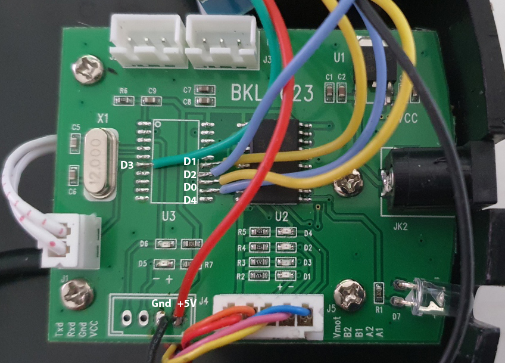

Modding the Revopoint Pop turntable for slower rotation
=======================================================

Hardware Mods
-------------

1. Peel back the 4 feet under the turntable & remove the screws with a phillips head screwdriver
2. Use a hot air rework station to remove the STC microcontroller (U3). If you don't have a rework station, you can cut the legs off the IC with a sharp pair of side cutters, then desolder each leg individually. Clean & tin the pads with fresh solder.
3. Solder wires between the Wemos D1 Mini & empty pads on the chip:

|D1 Mini	|STC Pin	|Role	|
|---------------|---------------|-------|
|D3  GPIO0	|6		|Button	|
|D4  GPIO2	|16		|4A	|
|D0  GPIO16	|17		|3A	|
|D2  GPIO4	|18		|2A	|
|D1  GPIO5	|19		|1A	|
|+5V		|UART VCC	|	|
|Gnd		|UART Gnd	|	|

4. Mount the D1 Mini near the main PCB. I 3D printed a small block to stick it on top of, so I could drill a hole in the side of the case to provide access to the USB port of the D1 Mini.
5. Flash the firmware
6. Test the turntable
7. Close the case

Building Firmware
-----------------

The firmware is built through ESPHome: https://esphome.io/

1. Copy the .yaml files in the esphome directory to a working directory where you will save your ESPHome configs.
2. Edit `wifi.yaml` & `secrets.yaml` to set your network information & other passwords for this device (they can be anything, but you'll need them to access it over the network).
3. Build & upload the firmware by plugging the D1 mini into a USB port & typing `esphome turntable run`

Operation
---------

The turntable can be operated at different speeds through different button combinations:
- Short press, 1 revolution, 800 seconds
- Long press, 1 revolution, 160 seconds
- Double press, 1 revolution, 1600 seconds

Original Wiring Info
--------------------

The original PCB uses an STC12C5616AD Microcontroller. This is an 8051 based chip, and the datasheet is here:
https://datasheetspdf.com/mobile-pdf/853207/STC/STC12C5616AD/1

This chip is programmable over the UART, but the bootloader cannot dump the existing firmware, making binary patches problematic.

These are the connections between the microcontroller, stepper controller & motor:

|L293	|uc		| 															|
|-------|---------------|-----------------------------------------------------------------------------------------------------------------------|
|1A  	|Pin 19 P1.1	|															|
|2A  	|Pin 18 P1.0	|															|
|3A  	|Pin 17 P3.7	|															|
|4A  	|Pin 16 P2.7	|															|
|	|		|															|
|Button	|Pin 6  P3.2	|The button is pulled to ground when pressed, and floating normally. The microcontroller uses an internal pullup	|

|L293	|Motor		|
|-------|---------------|
|VCC2	|Red Vmot +12V	|
|4Y	|Orange B2	|
|3Y	|Yellow B1	|
|2Y	|Pink A2	|
|1Y	|Blue A1	|

